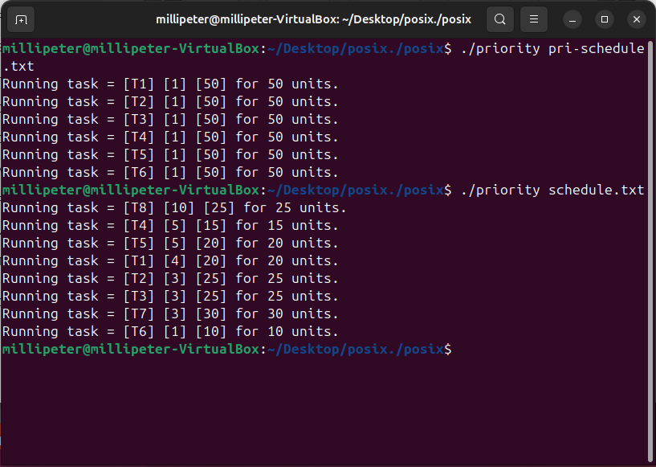

[Back to Portfolio](./)

Scheduling Algorithms
===============

-   **Class:** CSCI-431
-   **Grade:** TBD
-   **Language(s):** C
-   **Source Code Repository:**  https://github.com/Gabriel-TiradoRobles/CSCI-431-Final-Project
    (Please [email me](mailto:gjtiradorobles@csustudent.net?subject=GitHub%20Access) to request access.)

## Project description

The scheduling algorithms project for CSCI-431 required us to create 5 different algorithms that would simulate different ways an operating system would schedule processes to run on the CPU. The 5 algorithms that were created are:
- First Come First Serve (FCFS)
- Shortest Job First (SJF)
- Priority Scheduling
- Round Robin
- Priority Round Robin

## How to compile and run the program

There are different commands for making each specific scheduling algorithm the code below will compile each of the algorithms. Make sure you are in the same directory as all the C files and MakeFile

```bash
make fcfs
make sjf
make priority
make rr
make priority_rr
```

For running the compiled programs, run the following commands in the same directory the files were compiled for the coresponding algorithm.
```bash
./schedule_fcfs.o [FILENAME.txt]
./schedule_sjf.o [FILENAME.txt]
./schedule_priority.o [FILENAME.txt]
./schedule_rr.o [FILENAME.txt]
./schedule_priority_rr.o [FILENAME.txt]
```

## UI Design

When any of the above commands are run, the terminal will output the order the dummy processes based on the scheduling algorithm that was run. Certain scheduling algorithms like priority and shortest job first will default back to first come first served if all processes match priority or job length.

**Fig 1. First Come First Served scheduling output.**

  

**Fig 2. Shortest Job First scheduling output.**

  

**Fig 3. Priority scheduling output.**

  

**Fig 4. Round Robin scheduling output.**

  

**Fig 5. Priority Round Robin scheduling output.**

  


## 3. Additional Considerations

Note that these programs were created in Ubuntu and will require either a linux computer to run the make commands to compile the program or a virtual machine that can run a linux distribution.

[Back to Portfolio](./)
