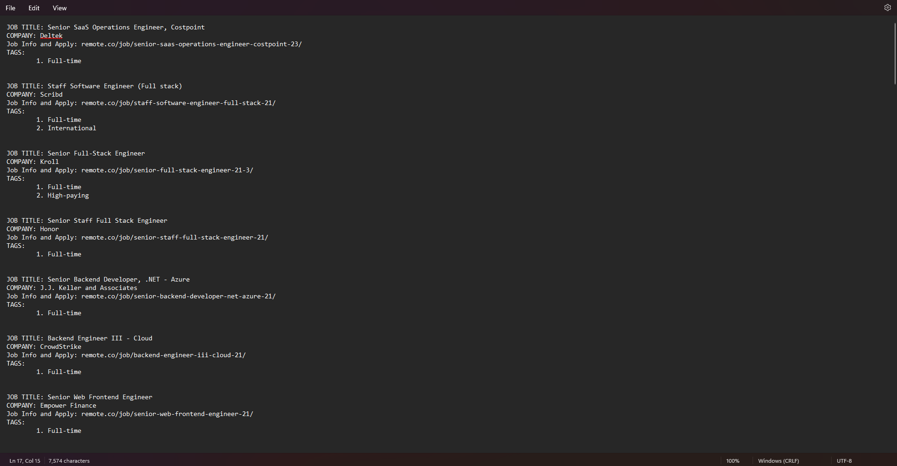
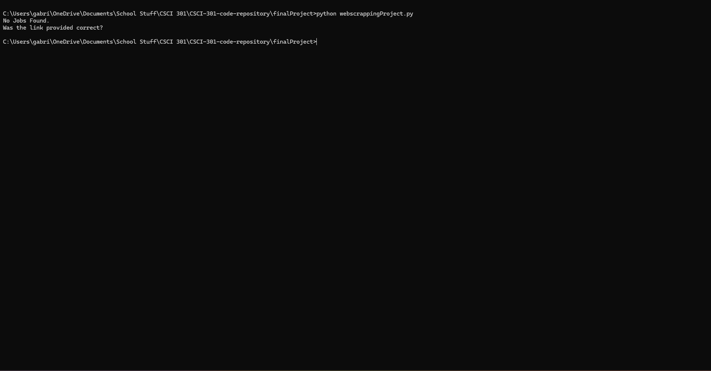

[Back to Portfolio](./)

Job Web Scraper
===============

-   **Class:** CSCI-301
-   **Grade:** A
-   **Language(s):** Python
-   **Source Code Repository:** [CSCI-301-code-repository/finalProject](https://github.com/Gabriel-TiradoRobles/CSCI-301-code-repository/tree/main/finalProject)  
    (Please [email me](mailto:gjtiradorobles@csustudent.net?subject=GitHub%20Access) to request access.)

## Project description

When the program is launched through the command prompt, it will go through the html of the website that it is currently targetting. The specific details that the program will search for are job titles, the company responsible for the job posting, a link that leads you to more information about the given job and its application page, and any special tags that the job posting has (e.g., Full-time, High-paying). Once all of this information has been scraped from the website, the program will proceed to output all the information onto the command line or to a file of a given name if specified.

## How to compile and run the program

How to run the program.

```bash
cd ./finalProject

pip install requests
pip install beautifulsoup4
python webscrappingProject.py >> output.txt
```

## UI Design

When the program is run without specifying an output file, the program will simply print the output to the command line (see Fig 1), when an output file is specified, the program will write down all output into the file (see Fig 2). If either there were no jobs found by the web scraper or the website given was invalid, the program will output stating that no jobs were found (see Fig 3).

  
Fig 1. Example output to command line after website was successfully scraped.

  
Fig 2. Example output to a file after website was successfully scraped.

  
Fig 3. Feedback when no job results were found.

## 3. Additional Considerations

The two libraries listed in the **How to Compile** section must be installed before running the python script. To output to a file, you must add **>> fileName.txt** following the script name.

For more details see [GitHub Flavored Markdown](https://guides.github.com/features/mastering-markdown/).

[Back to Portfolio](./)
