[Back to Portfolio](./)

Job Web Scraper
===============

-   **Class:** CSCI-325
-   **Grade:** A
-   **Language(s):** Java
-   **Source Code Repository:** [CSCI-325-final-project](https://github.com/Gabriel-TiradoRobles/CSCI-325-final-project)  
    (Please [email me](mailto:gjtiradorobles@csustudent.net?subject=GitHub%20Access) to request access.)

## 1. Project description

The program simulates a system to manage a store's inventory, tracking any shipments, and generating various reports about the store. For the part that manages the store's inventory, the user has the ability to load an inventory through a formatted text file, create inventory items through the program, and edit data on individual items. The user also has the ability to look through and view the entire store's inventory and save the inventory onto a text file.

For tracking shipments and generating reports, when the user attempt to view the shipment list, the program will load all shipments from a predetermined text file. Afterwards the user can look through any shipments and delete any shipment they wish to remove as well. For generating reports, the user has a choice between generating a sales report, shipment report, or an inventory report.

## How to compile and run the program

Program is already compiled in the dist folder of the project. Once you enter the dist folder, insert the following command past the **cd** command

```bash
cd ./InventoryManagmentSystem/dist

java -jar "InventoryManagmentSystem.jar"
```

## 2. UI Design

When the program is run, the user will begin in the main menu of the program **(see Fig 1)** and will be given the options to view or modify inventory, track shipments, generate reports, or quit the program. The various sections below will guide through the rest of the programs pages.

**Fig 1. Program Main Menu.**

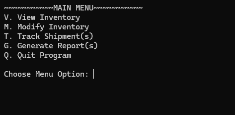  

### View Inventory
The view inventory portion of the program allows the user to look through and select specific items based on their SKU number **(see Fig 2)** from a loaded inventory. When a SKU number is entered to look at a specific item, all relevant information about that item is displayed **(see Fig 3)**.

**Fig 2. View Inventory Menu**

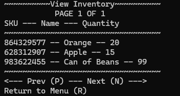 

**Fig 3. View Specific Item**

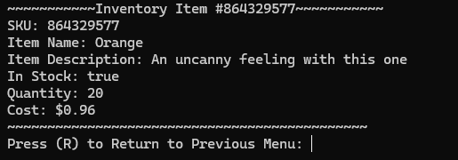 

### Modify Inventory
The modify inventory portion of the program allows the user to load an inventory from a file, create items from scratch, or modify specific items. Some options will not initially show **(see Fig 4)** until either inventory items are added or a file has been loaded in **(see Fig 5)**. When loading the inventory from a file, the program will list out any files that it has found stored in its InventoryFiles directory to be selected to load **(see Fig 6)**.

For modifying a specific item, the user will navigate through the menu similar to viewing the inventory and select the SKU number of the item they wish to modify **(see Fig 7)**. Upon viewing a specific item to modify, the user may either modify any specific attribute of the item or choose to remove the item **(see Fig 8)**.

**Fig 4. Modify Inventory Main Menu**

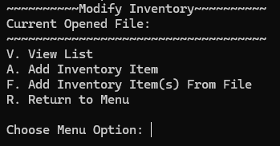 

**Fig 5. Modify Inventory Main Menu (File Loaded)**

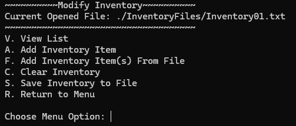 

**Fig 6. Load Inventory From File**

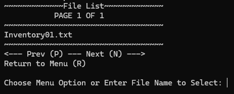 

**Fig 7. View Inventory Menu (Modify)**

 

**Fig 8. Modify Specific Item**

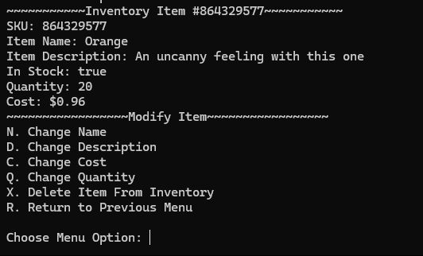 

### Track Shipment(s)
The track shipments portion of the program allows the user to view any shipments that are relevant for the store that the program is hosted by. The initial menu for tracking shipments will list all shipments from a file that has been automatically loaded into the program **(see Fig 9)**. Users are able to move through the pages to search for the tracking number of the specific shipment they wish to view.

Upon finding the shipment through the list and selecting it, the user will be met with the page that shows shipment details like its status and current location **(see Fig 10)**. In this page the user may either delete the selected shipment or return to the previous menu to view another shipment if they please.

**Fig 9. Track Shipment Main Menu**

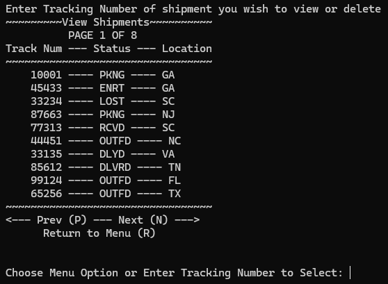 

**Fig 10. View Specific Shipment**

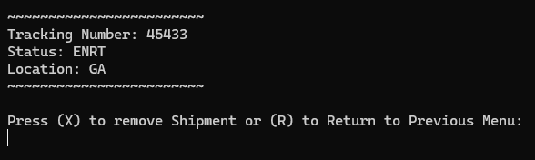 

### Generate Report(s)
The generate reports portion of the program allows the user to generate one of three reports. The main menu displays the options that the user may generate which are: a sales report, an inventory report, or a shipment report **(see Fig 11)**.

Upon selecting the sales report to generate, the user will be prompted to input the starting and ending date of the timeframe they wish to generate for and the sales amount that was for that time period **(see Fig 12)**. Upon selecting an inventory report to generate, the user will be prompted to input the SKU for the item they wish to report for, the item name, price, and quantity **(see Fig 13)**. Upon selecting a shipment report to generate, the user will be prompted to input the shipment tracking number and the updated status for the shipment **(see Fig 14)**.

Once any of the following reports have been generated, the program will state the file name of the generated report and proceed to ask the user if they'd like to generate another report. If the user chooses to, they will return to the generate report menu once again. Otherwise they'll return back to the main menu.

**Fig 11. Generate Report Main Menu**

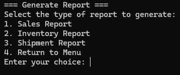 

**Fig 12. Generate Sales Report**

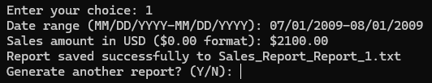 

**Fig 13. Generate Inventory Report**

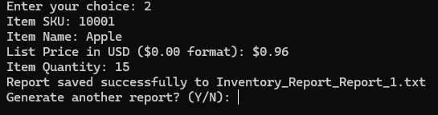 

**Fig 14. Generate Shipment Report**

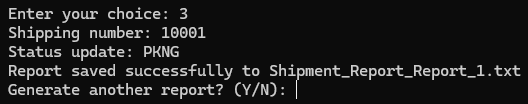 

## 3. Additional Considerations

The program was built on java version 21.0.3. The program will not run if you attempt to open the .jar file via file explorer; it must be ran using the command in the **How to compile and run the program** section. The README.txt file in the /dist directory will give more information on running the program.

This program was a group project with the three people responsible being Andrew Taylor, Evan Hughes, and myself. The parts of the project that had been programed by me were the view and modify inventory sections with some assistance on saving to a file.

[Back to Portfolio](./)
