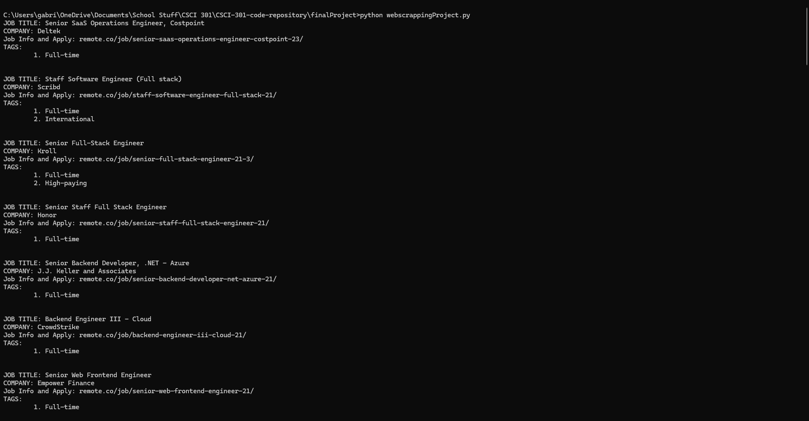

[Back to Portfolio](./)

Job Web Scraper
===============

-   **Class:** CSCI-325
-   **Grade:** A
-   **Language(s):** Java
-   **Source Code Repository:** [CSCI-325-final-project](https://github.com/Gabriel-TiradoRobles/CSCI-325-final-project)  
    (Please [email me](mailto:gjtiradorobles@csustudent.net?subject=GitHub%20Access) to request access.)

## Project description

The program simulates a system to manage a store's inventory, tracking any shipments, and generating various reports about the store. For the part that manages the store's inventory, the user has the ability to load an inventory through a formatted text file, create inventory items through the program, and edit data on individual items. The user also has the ability to look through and view the entire store's inventory and save the inventory onto a text file.

For tracking shipments and generating reports, when the user attempt to view the shipment list, the program will load all shipments from a predetermined text file. Afterwards the user can look through any shipments and delete any shipment they wish to remove as well. For generating reports, the user has a choice between generating a sales report, shipment report, or an inventory report.

## How to compile and run the program

Program is already compiled in the dist folder of the project. Once you enter the dist folder, insert the following command past the **cd** command

```bash
cd ./InventoryManagmentSystem/dist

java -jar "InventoryManagmentSystem.jar"
```

## UI Design

When the program is run, the user will begin in the main menu of the program (see Fig 1) and will be given the options to view or modify inventory, track shipments, generate reports, or quit the program. The various sections below will guide through the rest of the programs pages.

**Fig 1. Example output to command line after website was successfully scraped.**
  

### View Inventory


### Modify Inventory


### Track Shipment(s)


### Generate Report(s)


## 3. Additional Considerations

The program was built on java version 21.0.3. The program will not run if you attempt to open the .jar file via file explorer; it must be ran using the command in the **How to compile and run the program** section. The README.txt file in the /dist directory will give more information on running the program.

This program was a group project with the three people responsible being Andrew Taylor, Evan Hughes, and myself. The parts of the project that had been programed by me were the view and modify inventory sections with some assistance on saving to a file.

[Back to Portfolio](./)
