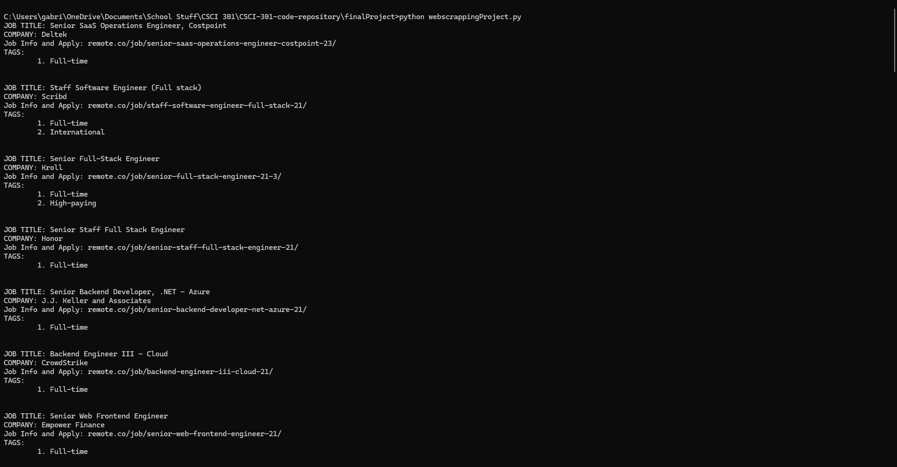

Portfolio
=========

Programming Projects
--------------------

*For access to my private project repositories, please [email me](mailto:gjtiradorobles@csustudent.net?subject=GitHub%20Access) with the subject line, GitHub Access.

---
### [Job Web Scraper | CSCI 301](csci301Project.md)

---
### [Project 2 Title | CSCI 315](project1)

---
### [Inventory Management Project | CSCI 325](csci325Project.md)

---
### [Project 4 Title | CSCI 332](project1)

---

Ethics Papers
-------------

### [Information Explosion, Ai, and Privacy](/pdf/Gabriel_Tirado_Ethics_Paper_CSCI235.pdf)

-   **Class:** CSCI-235 
-   **Grade:** A

### [Ethics of Copying Code](/pdf/Gabriel_Tirado_Ethics_Paper_CSCI301.pdf)

-   **Class:** CSCI-301
-   **Grade:** A

### [The Ethics of Artificial Intelligence](/pdf/Gabriel_Tirado_Ethics_Paper_CSCI325.pdf)

-   **Class:** CSCI-325
-   **Grade:** A

---

Presentations
-------------

### [Presentation 1 Title](/pdf/sample_presentation.pdf)

- **Class:** 
- **Grade:**

### [Presentation 2 Title](/pdf/sample_presentation.pdf)

- **Class:** 
- **Grade:**

---

Page template forked from <a href="https://github.com/csu-cs/csci-portfolio">CSU-CS</a>

<!-- Remove above link if you don't want to attributive -->
